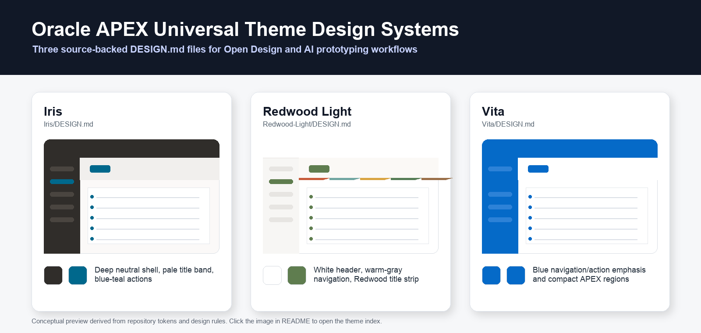
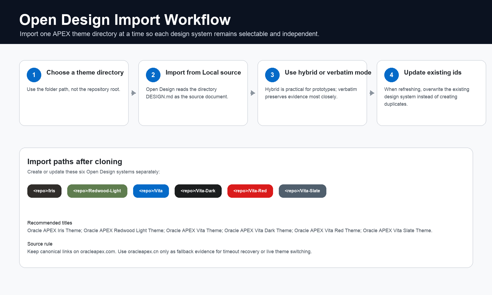

# Oracle APEX Universal Theme Design Systems

[中文说明](README.zh-CN.md)

Source-backed `DESIGN.md` files for Oracle APEX Universal Theme styles, prepared for Open Design and other design-agent workflows.

This repository is not an Oracle project. It preserves observed Oracle APEX Universal Theme design evidence so teams can generate or review Oracle APEX-style web prototypes without mixing theme styles together.

## Visual Overview

[](DESIGN.md)

Click the overview image to open the theme index.

| Theme | Shell sketch | Primary visual rule |
| --- | --- | --- |
| Iris | `dark header + dark side nav + pale title band + white regions` | Use `#302D2A` for the app shell and keep `#00688c` for links, focus, badges, and primary actions. |
| Redwood Light | `white header + warm-gray side nav + Redwood title strip + white regions` | Use warm neutral surfaces and sage/teal accents; do not turn it into a green Vita shell. |
| Vita | `blue header + blue side nav + white title/content + compact regions` | Use `#056AC8` as the high-emphasis navigation and action color. |
| Vita - Dark | `blue header + charcoal side nav + dark content regions` | Keep Vita density, but switch app surfaces to charcoal and dark component chrome. |
| Vita - Red | `red header + light side nav + white content regions` | Use `#DA1B1B` as the primary accent without turning every region into an alert. |
| Vita - Slate | `slate header + dark side nav + pale slate title band` | Combine Vita component density with slate navigation and muted neutral surfaces. |

The project keeps each theme style as a separate design system. The overview above is derived from the documented tokens; it is not a screenshot of Oracle APEX.

## What Is Included

| Theme style | Design system file | Verified coverage | Visual signature |
| --- | --- | --- | --- |
| Iris | [Iris/DESIGN.md](Iris/DESIGN.md) + [manifest](Iris/design-system.manifest.json) | 71 unique Design, Components, and Icons pages; 73 menu entries; includes tokens/CSS/Reference/patterns/catalogs/example resources | Deep neutral shell, warm off-white canvas, pale title band, blue-teal action accents |
| Redwood Light | [Redwood-Light/DESIGN.md](Redwood-Light/DESIGN.md) + [manifest](Redwood-Light/design-system.manifest.json) | 71 unique Design, Components, and Icons pages; 73 menu entries; includes tokens/CSS/Reference/patterns/catalogs/example resources | White header, warm-gray navigation, Redwood decorative title strip, sage/teal accents |
| Vita | [Vita/DESIGN.md](Vita/DESIGN.md) + [manifest](Vita/design-system.manifest.json) | 71 unique Design, Components, and Icons pages; 73 menu entries; includes tokens/CSS/Reference/patterns/catalogs/example resources | White surfaces, blue navigation/action emphasis, compact APEX application shell |
| Vita - Dark | [Vita-Dark/DESIGN.md](Vita-Dark/DESIGN.md) + [manifest](Vita-Dark/design-system.manifest.json) | 71 unique Design, Components, and Icons pages; 73 menu entries; includes tokens/CSS/Reference/patterns/catalogs/example resources | Charcoal application shell, dark regions, Vita blue action emphasis |
| Vita - Red | [Vita-Red/DESIGN.md](Vita-Red/DESIGN.md) + [manifest](Vita-Red/design-system.manifest.json) | 71 unique Design, Components, and Icons pages; 73 menu entries; includes tokens/CSS/Reference/patterns/catalogs/example resources | White content surfaces, red header/action emphasis, compact Vita structure |
| Vita - Slate | [Vita-Slate/DESIGN.md](Vita-Slate/DESIGN.md) + [manifest](Vita-Slate/design-system.manifest.json) | 71 unique Design, Components, and Icons pages; 73 menu entries; includes tokens/CSS/Reference/patterns/catalogs/example resources | Slate navigation chrome, pale title band, muted gray primary emphasis |

The top-level [DESIGN.md](DESIGN.md) is the repository index. Each theme directory is an independent design system and contains a canonical `DESIGN.md` file with YAML front matter plus human-readable guidance. Each theme also includes companion resources for higher-fidelity enterprise prototype generation: a manifest, machine-readable tokens, a compact CSS adapter, Reference files, enterprise patterns, structured catalogs, and an HTML example.

## Repository Layout

```text
.
|-- README.md
|-- README.zh-CN.md
|-- DESIGN.md
|-- Iris/
|   |-- DESIGN.md
|   |-- catalog/
|   |-- design-system.manifest.json
|   |-- examples/
|   |-- patterns/
|   |-- reference/
|   |-- styles/
|   `-- tokens/
|-- Redwood-Light/
|   |-- DESIGN.md
|   |-- catalog/
|   |-- design-system.manifest.json
|   |-- examples/
|   |-- patterns/
|   |-- reference/
|   |-- styles/
|   `-- tokens/
|-- Vita/
|   |-- DESIGN.md
|   |-- catalog/
|   |-- design-system.manifest.json
|   |-- examples/
|   |-- patterns/
|   |-- reference/
|   |-- styles/
|   `-- tokens/
|-- Vita-Dark/
|   |-- DESIGN.md
|   |-- catalog/
|   |-- design-system.manifest.json
|   |-- examples/
|   |-- patterns/
|   |-- reference/
|   |-- styles/
|   `-- tokens/
|-- Vita-Red/
|   |-- DESIGN.md
|   |-- catalog/
|   |-- design-system.manifest.json
|   |-- examples/
|   |-- patterns/
|   |-- reference/
|   |-- styles/
|   `-- tokens/
|-- Vita-Slate/
|   |-- DESIGN.md
|   |-- catalog/
|   |-- design-system.manifest.json
|   |-- examples/
|   |-- patterns/
|   |-- reference/
|   |-- styles/
|   `-- tokens/
|-- docs/
|   |-- assets/
|   |-- maintenance.md
|   `-- open-design-import.md
`-- CONTRIBUTING.md
```

## Get Started

Clone the repository:

```sh
git clone https://github.com/wfg2513148/apex-design.git
cd apex-design
```

Choose one theme directory and import the full theme directory so Open Design can see the companion manifest, token JSON, CSS, Reference files, enterprise patterns, structured catalogs, and example page.

## Use With Open Design

[](docs/open-design-import.md)

Click the workflow image to open the step-by-step Open Design import guide.

Import each theme directory as its own design system. Do not import the repository root if you want independent theme-style choices. The full directory import is recommended because each `DESIGN.md` is supported by `design-system.manifest.json`, theme token JSON, theme CSS adapter, `reference/`, `patterns/`, `catalog/`, and `examples/enterprise-hr-dashboard.html`.

Example project paths after cloning:

```text
<repo>/Iris
<repo>/Redwood-Light
<repo>/Vita
<repo>/Vita-Dark
<repo>/Vita-Red
<repo>/Vita-Slate
```

Recommended Open Design import mode:

- Use `hybrid` when you want Open Design to make the system convenient for prototype generation.
- Use `verbatim` when source preservation matters more than normalized generated artifacts.
- Keep theme styles separate unless you are intentionally building a comparison or derived multi-theme package.

See [docs/open-design-import.md](docs/open-design-import.md) for step-by-step import guidance.

## Use With AI Prototyping Tools

Give the relevant theme file to the prototyping tool as the design-system source:

```text
Use Iris/DESIGN.md as the only design system. Generate an Oracle APEX Universal Theme screen using the Iris theme style.
```

Practical rules:

- Pick exactly one theme style per prototype unless the task is a comparison.
- Preserve Oracle APEX terms such as Application, Page, Region, Interactive Grid, Interactive Report, Page Items, Dynamic Action, Process, Validation, Breadcrumb, and Wizard.
- Prefer APEX components from the catalog before inventing generic dashboard cards or marketing sections.
- Use canonical URLs recorded in the files for source references.

## Source Evidence

Primary source family:

```text
https://oracleapex.com/ords/r/apex_pm/ut/...
```

Fallback evidence host:

```text
https://oracleapex.cn/ords/r/test/ut/...
```

The fallback host is used only when the primary source times out or when live theme-style switching is needed for verification. Canonical links in this repository should continue to point to `oracleapex.com`.

## Maintenance Status

Current corpus:

- 6 theme styles
- 71 unique Design, Components, and Icons pages per theme
- 73 required menu entries per theme, including aliases
- Machine-readable YAML front matter in every theme file
- Human-readable Open Design generation rules in every theme file
- Companion packages for all six themes with manifest, tokens, CSS adapter, Reference layer, enterprise pattern layer, structured catalogs, and enterprise HR example

See [docs/maintenance.md](docs/maintenance.md) for refresh, verification, and release notes.

## Contributing

Contributions should preserve observed Oracle APEX behavior rather than redesigning it. Before opening a change, read [CONTRIBUTING.md](CONTRIBUTING.md).

High-level rules:

- Keep each theme style independent.
- Keep YAML front matter machine-readable.
- Keep canonical URLs on `oracleapex.com`.
- Clearly separate observed tokens from interpretation or generation advice.
- Avoid broad formatting churn in extracted Markdown.

## Disclaimer

Oracle, Oracle APEX, and related marks belong to Oracle and/or its affiliates. This repository is an independent documentation and design-system extraction project and is not endorsed by Oracle.
